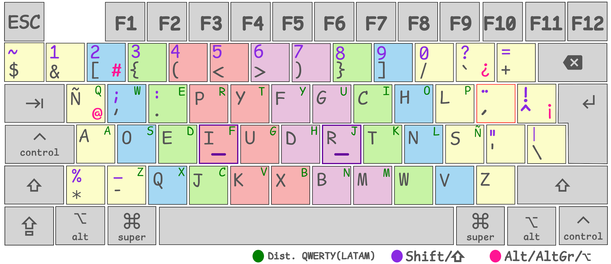

```
╦  ┌─┐┌┬┐┬┌┐┌┌─┐┌┬┐┌─┐┬─┐┬┌─┐┌─┐┌┐┌
║  ├─┤ │ ││││├─┤│││├┤ ├┬┘││  ├─┤│││
╩═╝┴ ┴ ┴ ┴┘└┘┴ ┴┴ ┴└─┘┴└─┴└─┘┴ ┴┘└┘
╔╦╗╦  ╦┌─┐┬─┐┌─┐┬┌─
 ║║╚╗╔╝│ │├┬┘├─┤├┴┐
═╩╝ ╚╝ └─┘┴└─┴ ┴┴ ┴
┌─┐┌─┐┬─┐  ╔╦╗┌─┐┬  ┬┌─┐┬  ┌─┐┌─┐┌─┐┬─┐┌─┐
├┤ │ │├┬┘   ║║├┤ └┐┌┘├┤ │  │ │├─┘├┤ ├┬┘└─┐
└  └─┘┴└─  ═╩╝└─┘ └┘ └─┘┴─┘└─┘┴  └─┘┴└─└─┘
==========================================
```

Distribución de teclado Dvorak latinoamericano orientado a desarrolladores, basado en las distribuciones:

- [Dvorak Latam](https://github.com/flobosg/latam-dvorak)
- [Programmer Dvorak Keyboard Layout](https://www.kaufmann.no/roland/dvorak/)



## Instalación

### Linux

#### Xorg

Es recomendable realizar un respaldo de los archivos de configuración de teclado antes de instalar esta distribución:

```bash
sudo cp /usr/share/X11/xkb/symbols/latam /usr/share/X11/xkb/symbols/latam.bak
sudo cp /usr/share/X11/xkb/rules/evdev.xml /usr/share/X11/xkb/rules/evdev.xml.bak
sudo cp /usr/share/X11/xkb/rules/evdev.lst /usr/share/X11/xkb/rules/evdev.lst.bak
```

Agregar el contenido del archivo `./Linuxldvd.xmap` al final del archivo `/usr/share/X11/xkb/simbols/latam`:

```bash
cat ./Linuxldvd.xmap >> /usr/share/X11/xkb/symbols/latam
```

A continuación, editar el archivo `/usr/share/X11/xkb/rules/evdev.xml` y agregar la variante dentro de la distribución `latam` de
la siguiente manera:

```xml
<layout>
    <configItem>
        <name>latam</name>
        <shortDescription>es</shortDescription>
        <!--...-->
    </configItem>
    <variantlist>
        <!-- Inicio -->
        <!-- Al final de este tag agregar: -->
        <variant>
            <configItem>
                <name>ldvd</name>
                <description>Spanish (Latin American Dvorak for Developers)</description>
            </configItem>
        </variant>
        <!-- Fin -->
    </variantlist>
</layout>
```

En el archivo `/usr/share/X11/xkb/rules/evdev.lst` agregar la distribución `latam` en la sección `! variant`:

```
! ...
! variant
! ...
  cat             es: Catalan (Spain, with middle-dot L)
  nodeadkeys      latam: Spanish (Latin American, no dead keys)
  deadtilde       latam: Spanish (Latin American, dead tilde)
  dvorak          latam: Spanish (Latin American, Dvorak)
  colemak         latam: Spanish (Latin American, Colemak)
! Agrega la siguiente línea:
  ldvd            latam: Spanish (Latin American Dvorak for Developers)
! ...
```

Para cargar la nueva distribución ingresar:

```bash
setxkbmap latam ldvd
```

#### Keymap de consola

Copiar el archivo `./Linux/ldvd.map.gz` al diretorio de keymaps (Normalmente `/usr/share/keymaps/i386/dvorak/`):

```bash
sudo cp ./Linux/ldvd.map.gz /usr/share/keymaps/i386/dvorak
```

> En archlinux la ruta es `/usr/share/kbd/keymaps/i386/dvorak/`

Algunas distribuciones de Linux utilizan `/etc/conf.d/keymaps` para configurar la distribución de teclado. Editar el archivo:

```
keymap=ldvd
```

> En archlinux la ruta es `/etc/vconsole.conf` y solo debe contener:
>
> ```KEYMAP=ldvd```

En el siguiente reinicio la consola carga la configuración de teclado, si se quiere probar la configuración en la sesión actual, ejecutar:

```bash
loadkeys ldvd
```

### Windows

Para Windows hay dos formas para instalar la distribución:

1. Ejecutar el archivo `./Windows/install/setup.exe`.
2. Abrir el archivo `ldvd.klc` con la aplicación
  [Microsoft Keyboard Layout Creator](https://www.microsoft.com/en-us/download/details.aspx?id=102134). Se puede editar la
  configuración y generar el instalador para luego ejecutarlo como en el paso 1.

Después de instalar la distribución, realizar el cambio de distribución de teclado, seguir los pasos descritos en la página oficial de Windows:

- [Windows 7/8](https://support.microsoft.com/es-es/windows/cambiar-la-distribuci%C3%B3n-del-teclado-245c49b8-f856-7fd7-2cf5-41e54c66f5b3)
- [Windows 10/11](https://support.microsoft.com/es-es/windows/administrar-la-configuraci%C3%B3n-de-idioma-de-entrada-y-pantalla-en-windows-12a10cb4-8626-9b77-0ccb-5013e0c7c7a2)

## Para tener en cuenta

### Cambios realizados

Los cambios que se realizan en esta distribución es el compendio de otros layouts y los principios del Dvorak original:

> El objetivo de Dvorak y Dealey era diseñar un teclado más ergonómico para disminuir los errores de mecanografía, aumentar la
> velocidad y reducir la fatiga del mecanógrafo[^1].

Los cambios realizados fueron basados en primera instancia tomando el layout de [Dvorak
Latam](https://github.com/flobosg/latam-dvorak) y de esta base se realizaron las siguientes modificaciones:

- Cambio entre las teclas `i` y `u`.
- La tecla `ñ` se deja a la izquierda de la fila superior.
- Todas las distribuciones de teclado no están optimizadas para escribir código fuente, basado en la distribución dvorak para
  desarrolladores se aplicaron los siguientes cambios:
    * Los números van secundarios a los símbolos, para ingresar los números se debe presionar la tecla `Shift` primero y se
      mantiene la disposicion de los numeros de forma incremental (1, 2, 3, 4, 5, 6, 7, 8, 9, 0).
    * Los simbolos pares (`[]`, `{}`, `()`, `<>`) se basa en que las letras deberían ser tecleadas alternando las dos manos.
    * El resto de los símbolos se adecuaron para minimizar los movimientos que reduzcan la fatiga del mecanógrafo.

### Tecla `Control`

En las distribucione de linux, la tecla control se intercambia con la tecla `Bloq Mayus` (o `Caps Lock`). Esto con el fin que en
muchos de los programas utilizados, las combinaciones de teclas se utiliza en gran medida la tecla Control, con esta disposición
queda mejor ubicada en la fila media donde descansan los dedos (Home Row Keys).

Si no desea utilizar esta configuración, en el archivo `./Linux/ldvd.xmap` borrar o comentar las lineas que se encuentrana al
final del archivo; para la distribución de consola se debe editar el archivo `./Linux/ldvd.map` e intercambiar los valores de los
*keycodes 29 y 58*, comprimir el archivo y copiarlo en el directorio de keymaps.

```bash
$ gzip -k ./Linux/ldvd.map
$ sudo cp ./Linux/ldvd.map.gz /usr/share/keymaps/i386/dvorak
```

En Windows se creó esta distribución a través de la aplicación *Microsoft Keyboard Layout Creator*, pero esta no permite remapear
las teclas que tengan una función común (`Espacio`, `Tab`, `Enter`, `Control`, etc.). En este caso la tecla `Control` y `Bloq Mayus` no
se intercambian. Si alguien sabe como se puede hacer este cambio (Sin necesidad de incluir algún programa extra o realizar cambios
que comprometan el sistema operativo) se pueden comunicar conmigo a traves del correo `wfabianrs@gmail.com`.


[^1]: https://es.wikipedia.org/wiki/Teclado_Dvorak
